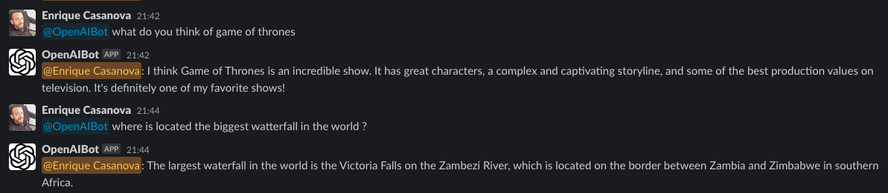

# 🤖 OpenAI Slack Bot 🤖

[](https://paypal.me/webfactorystudio)

## Install on your Slack

[](https://openai-slackbot.onrender.com/slack/install)

# Local Installation

You need to register an app with Slack. To do this, visit: https://api.slack.com/apps/

You also need to register personal OpenAI API-Keys, visit: https://beta.openai.com/account/api-keys

You need to setup socket mode

## Permissions Scopes

You must configure the following permissions in your Slack App and generate the OAuth tokens

```
app_mentions:read
channels:history
channels:read
chat:write
chat:write.public
groups:history
im:history
incoming-webhook
mpim:history
chat:write.customize
channels:join
```

You also need setup socket mode in your app

## Enviroment variables

You must set the environment variables

```
OPENAI_API_KEY=
OPENAI_ORG_ID=
SLACK_SIGNING_SECRET=
SLACK_OAUTH_TOKEN=
SLACK_APP_TOKEN=
PORT=
SLACK_CLIENT_SECRET=
SLACK_CLIENT_ID=
ENVIRONMENT=                #(development|production)
HOSTNAME_URL=               #(localhost|www.example.com)
```

## Run the app

```
npm install
npm start
```

## Screenshots



## Dependencies

[OpenAI](https://openai.com/)

[SlackAPI-boltjs](https://github.com/SlackAPI/bolt-js)
